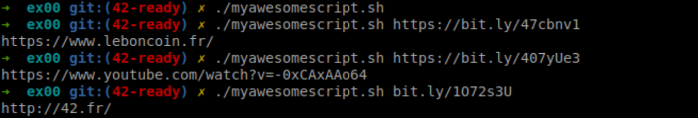
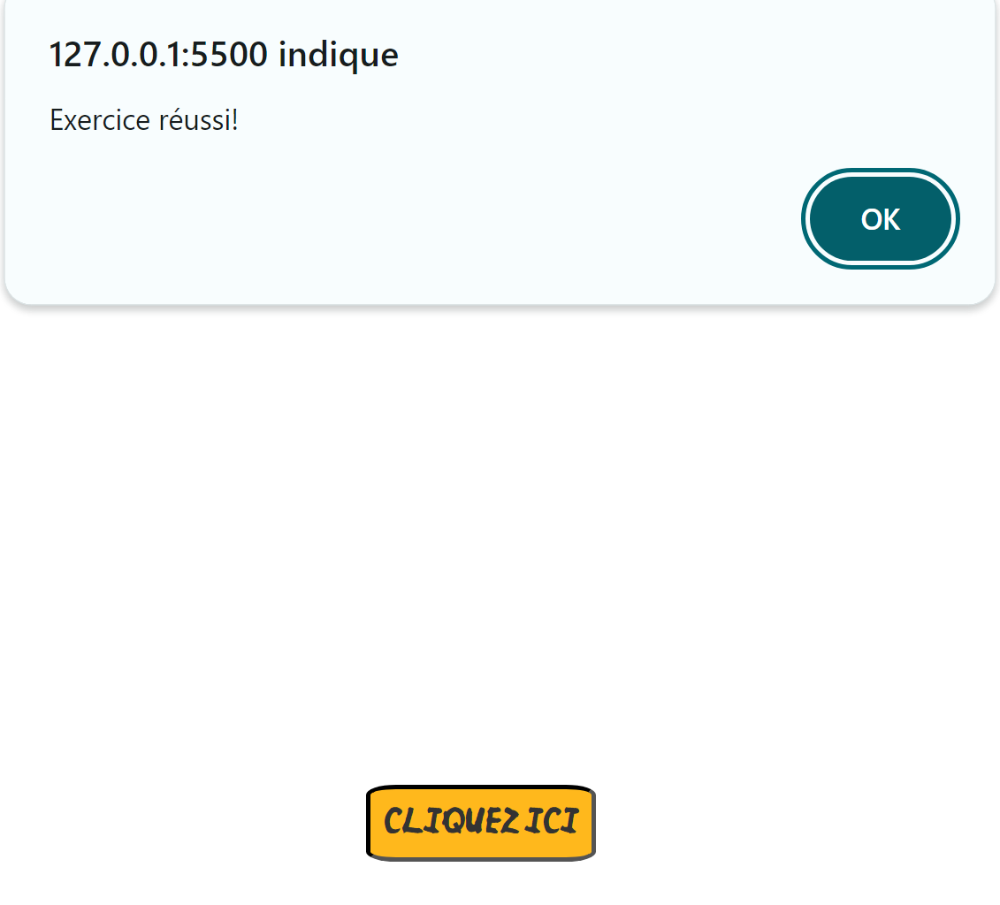
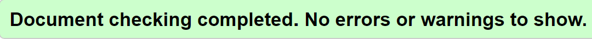

# Piscine PHP - Mon parcours d'apprentissage

Durant la Piscine PHP, j'ai accompli plusieurs exercices pour aiguiser mes compétences en développement web. Voici un aperçu de mes réalisations :

## PHP-00 - Introduction à HTML et CSS
Lors de cette première journée, j'ai exploré les bases de HTML et CSS, les langages fondamentaux pour la création de pages web. J'ai également créé un script shell pour résoudre les URLs raccourcies via bit.ly.

### ex00 - Fonctionnement de bit.ly
J'ai écrit un script shell qui résout les URLs raccourcies via bit.ly pour révéler leur adresse de redirection finale. L'utilisation des commandes `curl`, `grep`, et `cut` a été essentielle pour compléter cet exercice avec succès.

### ex01 - Création d'un CV en HTML/CSS
J'ai conçu un CV en HTML et CSS, mettant en pratique la sémantique des balises HTML et la séparation du contenu et de la présentation.

### ex02 - Formulaire HTML avec Validation JavaScript
Cet exercice est consacré à la création d'un formulaire HTML avec une validation JavaScript pour collecter des informations de contact.

### ex03 - Reproduction Fidèle d'une Page Web
Cet exercice est consacré à la reproduction la plus exacte possible d'une page web à partir d'une capture d'écran et d'un fichier CSS donné, sans modifier le CSS.

### ex04 - Intégration de Scripts JavaScript
L'objectif était de créer une page HTML qui intègre correctement quatre scripts JavaScript afin d'afficher une pop-up sans erreurs.

### ex05 - Conformité avec les Normes W3C
Pour cet exercice, j'ai modifié le code HTML d'une page web existante pour assurer sa conformité avec les normes W3C, ce qui signifie qu'il ne devait y avoir aucune erreur ni avertissement.

