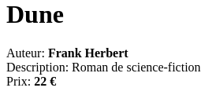
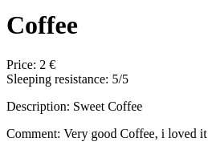
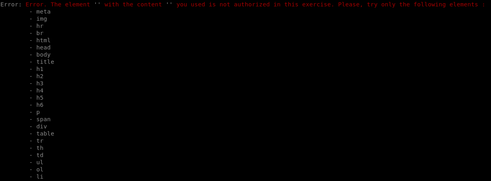

# Piscine PHP - Mon parcours d'apprentissage

Durant la Piscine PHP, j'ai accompli plusieurs exercices pour aiguiser mes compétences en développement web. Voici un aperçu de mes réalisations :

## PHP-00 - Introduction à HTML et CSS
Lors de cette première journée, j'ai exploré les bases de HTML, CSS et de Javascript les langages fondamentaux pour la création de pages web dynamiques. J'ai également créé un script shell pour résoudre les URLs raccourcies via bit.ly.

### ex00 - Fonctionnement de bit.ly :
J'ai écrit un script shell qui résout les URLs raccourcies via bit.ly pour révéler leur adresse de redirection finale. L'utilisation des commandes `curl`, `grep`, et `cut` a été essentielle pour compléter cet exercice avec succès.


### ex01 - Création d'un CV en HTML/CSS :
J'ai conçu un CV en HTML et CSS, mettant en pratique la sémantique des balises HTML et la séparation du contenu et de la présentation.

### ex02 - Formulaire HTML avec Validation JavaScript :
Cet exercice est consacré à la création d'un formulaire HTML avec une validation JavaScript pour collecter des informations de contact.

### ex03 - Reproduction Fidèle d'une Page Web :
Cet exercice est consacré à la reproduction la plus exacte possible d'une page web à partir d'une capture d'écran et d'un fichier CSS donné, sans modifier le CSS.


### ex04 - Intégration de Scripts JavaScript :
L'objectif était de créer une page HTML qui intègre correctement quatre scripts JavaScript afin d'afficher une pop-up sans erreurs.


### ex05 - Conformité avec les Normes W3C :
Pour cet exercice, j'ai modifié le code HTML d'une page web existante pour assurer sa conformité avec les normes W3C, ce qui signifie qu'il ne devait y avoir aucune erreur ni avertissement.


### Résultat final :


## PHP-01 - Introduction à PHP
Lors de cette seconde journée, j'ai fait pour la première fois du PHP. Le but de cette journée était de découvrir la création et la manipulation de variables, de strings et de tableaux en PHP. On y apprend également la manipulation de file descriptors.

### ex00 - Var
Dans cet exercice, il faut initialiser 4 variables de types différents et créer un programme qui nous permette d'afficher dynamiquement leur valeur ainsi que leur type. Voici le résultat attendu : 


Voici mon résultat :


### ex01 - CSV :
Cet exercice apprend à lire et traiter des données stockées dans un fichier texte en utilisant PHP. Il enseigne comment ouvrir un fichier, lire son contenu, séparer les valeurs stockées en utilisant une virgule comme délimiteur, et ensuite afficher ces valeurs ligne par ligne, après avoir retiré les espaces superflus. Cela donne une base pour comprendre le traitement de fichiers et la manipulation de chaînes en PHP, des compétences essentielles pour le traitement de données et l'automatisation de tâches. Voici le résultat attendu : 


Voici mon résultat :


### ex02 - Anciens temps :
Le but de cet exercice est d'apprendre à créer et utiliser les tableaux associatifs en utilisant une liste d'individus avec un nom et un âge et d'en afficher le résultat. Voici le résultat attendu : 


Voici mon résultat :


### ex03 - Temps du tri :
Le but de cet exercice est le même que l'exercice précédent, la différence étant qu'il faut inverser la clé et la valeur dans le tableau (le nom et l'âge sont inversés) et il faut également trier le résultat (le nom) en ordre alphabétique inverse (Z-A).
Voici le résultat attendu : 


Voici mon résultat :


### ex04 - Etats & Capitales :
On est toujours dans de la manipulation de tableaux grâce à l'exemple des états américains. Le but de cet exercice est de trouver une clé dans un tableau (states), d'en obtenir la valeur, puis au travers de cette valeur, chercher une 2e clé dans un 2e tableau (capitals) qui nous donnera la valeur finale, de telle sorte que l'on a ça : California --> CN | CN --> Sacramento.
Voici le résultat attendu : 


Voici mon résultat :


### ex05 - Recherche d’états ou capitales :
Exercice similaire à celui précédant, mais plus poussé car il faut faire un système sensible à la casse et pouvoir trouver l'état à travers la capitale de l'état.
Voici le résultat attendu : 


Voici mon résultat :


### ex06 - Mendeleiev table :
C'est l'exercice final de ce jour. Il faut reproduire un tableau de Mendeleïev grâce à des fonctions en PHP qui vont générer du code HTML, qui va être inscrit dans un fichier .html et afficher une page HTML avec un tableau de Mendeleïev.
Voici mon résultat :


### Résultat final :


## PHP-02 - Oob
Lors de cette troisième journée, on va apprendre l'aspect orienté objet du langage PHP. On va créer nos premières classes pour générer des pages HTML et en modifier le contenu dynamiquement. On va même créer un checker de page HTML sommaire afin de pousser la difficulté un peu plus loin.

### ex00 - Les paramètres HTML :
Le but de cet exercice est de créer une classe à laquelle on peut donner un fichier template qui peut y remplacer certains éléments et générer un nouveau fichier .html afin de créer une nouvelle page.
Voici le résultat attendu : 


Voici mon résultat :


### ex01 - Affichage de l’object :
Le but de cet exercice est de nous enseigner à ajouter une balise fermante html (<p> et </p>) à travers une classe PHP dans un fichier et de le générer afin d'afficher une suite de paragraphes.
Voici mon résultat :


### ex02 - Affichage de l’object 2 :
Le but de cet exercice est similaire à l'exercice 2 à l'exception que l'on doit maintenant utiliser la classe ReflectionClass qui nous permet d'avoir accès à des variables et des fonctions privées présentes dans des classes. Cet exercice nous enseigne également le concept d'héritage en PHP.
Voici le résultat attendu : 


Voici mon résultat :



### ex03 - Générer HTML :
Le but de cet exercice est de générer une page HTML entière à l'aide d'une série de balises autofermantes et de balises à contenu. On nous apprend également à throw et catch une exception si une balise autre que celles autorisées est utilisée.
Voici mon résultat :


### ex04 - Générer HTML 2 :
Le but de cet exercice est le même que le précédant à l'exception que la liste de balises autorisées s'accroît et qu'il faut désormais créer sa propre exception personnalisée.
Voici mon résultat :


Et voici l'exception personnalisée :



### ex05 - Valider HTML :
Le but de cet exercice est de créer un checker pour vérifier si la page HTML est conforme à un certain standard HTML très simple que l'on doit coder soi-même et qui est dicté par l'école. Si la page HTML est mauvaise, une erreur est renvoyée, sinon, une page HTML est générée (les exemples utilisés dans l'exercice ne sont pas très bons).


### Résultat final :


## PHP-03 - Composer
Lors de cette quatrieme journée, on va apprendre a utiliser Composer. Composer est un outil de gestion des dépendances pour PHP, permettant de faciliter l'installation et la mise à jour de bibliothèques ou packages utilisés dans des projets PHP. Il automatise le processus de téléchargement, d'installation et de mise à jour des bibliothèques, en se basant sur un fichier composer.json qui décrit les dépendances du projet.

On utilise notamment quatres fonctions principales avec Composer : 
```composer require```, qui ajoute une nouvelle dépendance au fichier composer.json et installe le package spécifié, mettant également à jour le fichier composer.lock.
```composer install``` installe les dépendances spécifiées dans le fichier composer.lock du projet, garantissant que l'environnement de développement reste cohérent entre tous les membres de l'équipe et les déploiements.
```composer update``` met à jour les dépendances du projet en fonction des versions disponibles les plus récentes compatibles avec les spécifications du fichier composer.json, et met à jour le fichier composer.lock en conséquence.
```composer remove``` permet de supprimer une dépendance du projet, en mettant à jour les fichiers composer.json et composer.lock pour refléter la suppression.

### ex00 - Installer le Composer au niveau global :
Le but du premier exercice est simple : installer Composer globalement sur l'ordinateur afin qu'il soit utilisable partout. Pour ce faire, le site de Composer a un tutoriel assez simple à suivre :

```https://getcomposer.org/download/```

Pour simplifier la chose, j'ai écrit un script (il faut absolument les droits ```sudo```).

### ex01 - La spécification des versions :
Le but de cet exercice est de nous enseigner les spécifications des versions. On va apprendre à installer n'importe quelle version que l'on veut avec ```composer require``` en utilisant certains opérateurs dont voici les explications :

^ (Caret): Met à jour à la dernière version mineure ou patch. Par exemple, ^2.0.0 permettra les mises à jour jusqu'à <3.0.0, excluant cette dernière.

~ (Tilde): Permet les mises à jour de versions mineures. Par exemple, ~2.0.0 permet les mises à jour jusqu'à <2.1.0, excluant cette dernière.

> (Plus grand que): Spécifie que la version doit être supérieure à la version donnée.

< (Plus petit que): Indique que la version doit être inférieure à la version spécifiée.

>= (Plus grand ou égal): Signifie que la version doit être égale ou supérieure à la version donnée.

<= (Plus petit ou égal): Indique que la version doit être égale ou inférieure à la version spécifiée.

* (Joker): Remplace n'importe quel nombre. Utilisé pour spécifier une plage de versions. Par exemple, 2.* correspond à toutes les versions commençant par 2..

### ex02 - Development requirement :
Le but de cet exercice est d'installer la version LTS de PhpUnit. Pour voir cette version, aller sur ce site : 

```https://phpunit.de/supported-versions.html```

### ex03 - Composer install vs. composer update :
Le but de cet exercice est de nous enseigner la difference entre ```composer install``` et ```composer update```.
```composer install``` est utilisé pour installer les dépendances du projet telles qu'elles sont définies dans le fichier composer.lock, assurant la cohérence des versions des paquets entre différents environnements. Si composer.lock n'existe pas, ```composer install``` se base sur composer.json et crée un composer.lock avec les versions installées. ```composer update```, quant à lui, met à jour les dépendances du projet en fonction des versions spécifiées dans composer.json, et met à jour composer.lock en conséquence. Cette commande peut donc modifier les versions des paquets installés, contrairement à ```composer install``` qui vise à maintenir une stabilité.

Pour comprendre l'impact des commandes ```composer install``` et ```composer update```, réalisons un exercice pratique. Commencez par naviguer dans le dossier `install` et exécutez ```composer install```, puis dans le dossier `update`, tapez ```composer update```. Ensuite, exécutez les fichiers `index.php` présents dans chacun des dossiers.

Résultat attendu pour le dossier `install` : 

```composer install``` installe les dépendances telles qu'elles sont spécifiées dans le fichier `composer.lock`, assurant ainsi la compatibilité et la stabilité des paquets avec votre projet.

Résultat attendu pour le dossier `update` : 

```composer update``` met à jour les paquets vers leurs dernières versions compatibles selon les contraintes définies dans `composer.json` et génère un nouveau `composer.lock`. Cela peut introduire des changements incompatibles si les paquets ont évolué entre-temps.

Dans cet exercice, j'ai intentionnellement utilisé le paquet ```alexradyuk/hellopackage``` en version 1.0.1, qui propose une fonction ```greet``` affichant "Hello world!". Cependant, une mise à jour ultérieure de ce paquet (version 1.0.2) a renommé cette fonction en ```hello```. Lorsque nous utilisons ```composer update```, la version la plus récente du paquet est installée, ce qui peut rendre le code incompatible si ce dernier attendait la fonction ```greet``` de la version 1.0.1. À l'inverse, ```composer install``` va simplement installer les versions des paquets telles qu'elles sont précisées dans `composer.lock`, maintenant ainsi la fonction ```greet``` et assurant la compatibilité avec notre code.


## PHP-04 - La base de Symfony
### ex00 - Première page :
Voici la commande utilisee pour installer la version LTS (Long Term Support) de Symfony via composer

```composer create-project symfony/skeleton d04 "6.4.*"```

Ensuite j'ai installe ca :
```sudo apt-get install php-xml```
Puis : 
```composer require symfony/framework-bundle```
Il ne faut surtout pas oublier d'installer les paquets avec ```composer install``` si on vient de clone le projet.
Ensuite, j'ai cree mon premier controller dans : 
```PHP03/Day-04/ex00/d04/src/E00Bundle/Controller```
J'ai ensuite crée mon premier bundle dans ```src``` et je l'ai déclaré dans ```bundles.php```
Pour vérifier que tout fonctionne, il on peut très bien utiliser les fonction suivantes :

```php bin/console debug:container | grep PopoBundle``` Pour obtenir le nom du bundle qui vient d'être déclaré. Et :
```php bin/console debug:router``` pour obtenir les routes disponibles.

Pour obtenir le résultat des routs, on peut utiliser : 
```curl http://127.0.0.1:8000/annotation```

Pour autoriser les annotations, il faut aller dans le fichier ```framework.yaml``` et mettre annotations à true. Puis installer ce paquet : ```composer require doctrine/annotations```

### ex01  Pages multiples :

Il faut installer ```composer require symfony/twig-bundle``` pour pouvoir obtenir le dossier template et avoir les outils pour créer des pages multiples.

On modifie ensuite le contenu de PopoController pour pouvoir afficher plusieurs pages.


