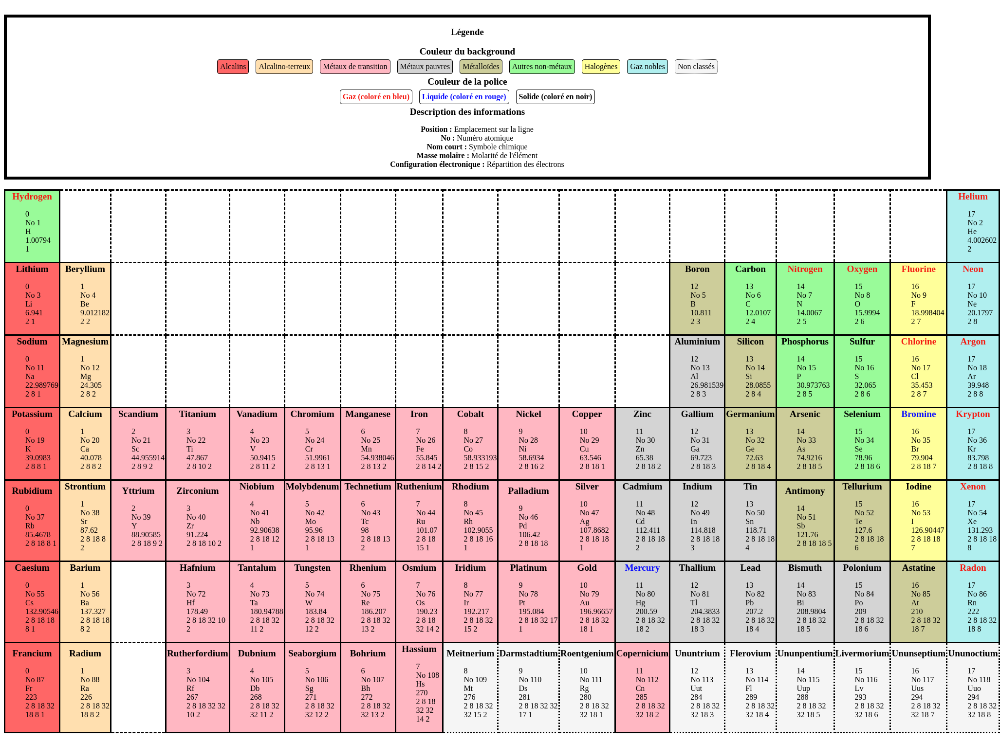

# Piscine PHP - Mon parcours d'apprentissage

Durant la Piscine PHP, j'ai accompli plusieurs exercices pour aiguiser mes compétences en développement web. Voici un aperçu de mes réalisations :

## PHP-00 - Introduction à HTML et CSS
Lors de cette première journée, j'ai exploré les bases de HTML, CSS et de Javascript les langages fondamentaux pour la création de pages web dynamiques. J'ai également créé un script shell pour résoudre les URLs raccourcies via bit.ly.

### ex00 - Fonctionnement de bit.ly :
J'ai écrit un script shell qui résout les URLs raccourcies via bit.ly pour révéler leur adresse de redirection finale. L'utilisation des commandes `curl`, `grep`, et `cut` a été essentielle pour compléter cet exercice avec succès.


### ex01 - Création d'un CV en HTML/CSS :
J'ai conçu un CV en HTML et CSS, mettant en pratique la sémantique des balises HTML et la séparation du contenu et de la présentation.

### ex02 - Formulaire HTML avec Validation JavaScript :
Cet exercice est consacré à la création d'un formulaire HTML avec une validation JavaScript pour collecter des informations de contact.

### ex03 - Reproduction Fidèle d'une Page Web :
Cet exercice est consacré à la reproduction la plus exacte possible d'une page web à partir d'une capture d'écran et d'un fichier CSS donné, sans modifier le CSS.


### ex04 - Intégration de Scripts JavaScript :
L'objectif était de créer une page HTML qui intègre correctement quatre scripts JavaScript afin d'afficher une pop-up sans erreurs.


### ex05 - Conformité avec les Normes W3C :
Pour cet exercice, j'ai modifié le code HTML d'une page web existante pour assurer sa conformité avec les normes W3C, ce qui signifie qu'il ne devait y avoir aucune erreur ni avertissement.


### Résultat final :


## PHP-01 - Introduction à PHP
Lors de cette seconde journée, j'ai fait pour la première fois du PHP. Le but de cette journée était de découvrir la création et la manipulation de variables, de strings et de tableaux en PHP. On y apprend également la manipulation de file descriptors.

### ex00 - Var
Dans cet exercice, il faut initialiser 4 variables de types différents et créer un programme qui nous permette d'afficher dynamiquement leur valeur ainsi que leur type. Voici le résultat attendu : 


Voici mon résultat :


### ex01 - CSV :
Cet exercice apprend à lire et traiter des données stockées dans un fichier texte en utilisant PHP. Il enseigne comment ouvrir un fichier, lire son contenu, séparer les valeurs stockées en utilisant une virgule comme délimiteur, et ensuite afficher ces valeurs ligne par ligne, après avoir retiré les espaces superflus. Cela donne une base pour comprendre le traitement de fichiers et la manipulation de chaînes en PHP, des compétences essentielles pour le traitement de données et l'automatisation de tâches. Voici le résultat attendu : 


Voici mon résultat :


### ex02 - Anciens temps :
Voici le résultat attendu : 


Voici mon résultat :


### ex03 - Temps du tri :
Voici le résultat attendu : 


Voici mon résultat :


### ex04 - Etats & Capitales :
Voici le résultat attendu : 


Voici mon résultat :


### ex05 - Recherche d’états ou capitales :
Voici le résultat attendu : 


Voici mon résultat :


### ex06 - Mendeleiev table :
Voici mon résultat :



### Résultat final :


## PHP-02 - Oob

### ex00 -  Les paramètres HTML :
### ex01 - Affichage de l’object :
### ex02 - Affichage de l’object 2 :
### ex03 - Générer HTML :
### ex04 - Générer HTML 2 :
### ex05 - Valider HTML :
### Résultat final :


## PHP-03 - Composer

### ex00 - Installer le Composer au niveau global :
### ex01 - La spécification des versions :
### ex02 - Development requirement :
### ex03 - Composer install vs. composer update :

## PHP-04 - La base de Symfony
### ex00 - Première page :
Voici la commande utilisee pour installer la version LTS (Long Term Support) de Symfony via composer

```composer create-project symfony/skeleton d04 "6.4.*"```

Ensuite j'ai installe ca :
```sudo apt-get install php-xml```
Puis : 
```composer require symfony/framework-bundle```
Il ne faut surtout pas oublier d'installer les paquets avec ```composer install``` si on vient de clone le projet.
Ensuite, j'ai cree mon premier controller dans : 
```PHP03/Day-04/ex00/d04/src/E00Bundle/Controller```
J'ai ensuite crée mon premier bundle dans ```src``` et je l'ai déclaré dans ```bundles.php```
Pour vérifier que tout fonctionne, il on peut très bien utiliser les fonction suivantes :

```php bin/console debug:container | grep PopoBundle``` Pour obtenir le nom du bundle qui vient d'être déclaré. Et :
```php bin/console debug:router``` pour obtenir les routes disponibles.

Pour obtenir le résultat des routs, on peut utiliser : 
```curl http://127.0.0.1:8000/annotation```

Pour autoriser les annotations, il faut aller dans le fichier ```framework.yaml``` et mettre annotations à true. Puis installer ce paquet : ```composer require doctrine/annotations```

### ex01  Pages multiples :

Il faut installer ```composer require symfony/twig-bundle``` pour pouvoir obtenir le dossier template et avoir les outils pour créer des pages multiples.

On modifie ensuite le contenu de PopoController pour pouvoir afficher plusieurs pages.


